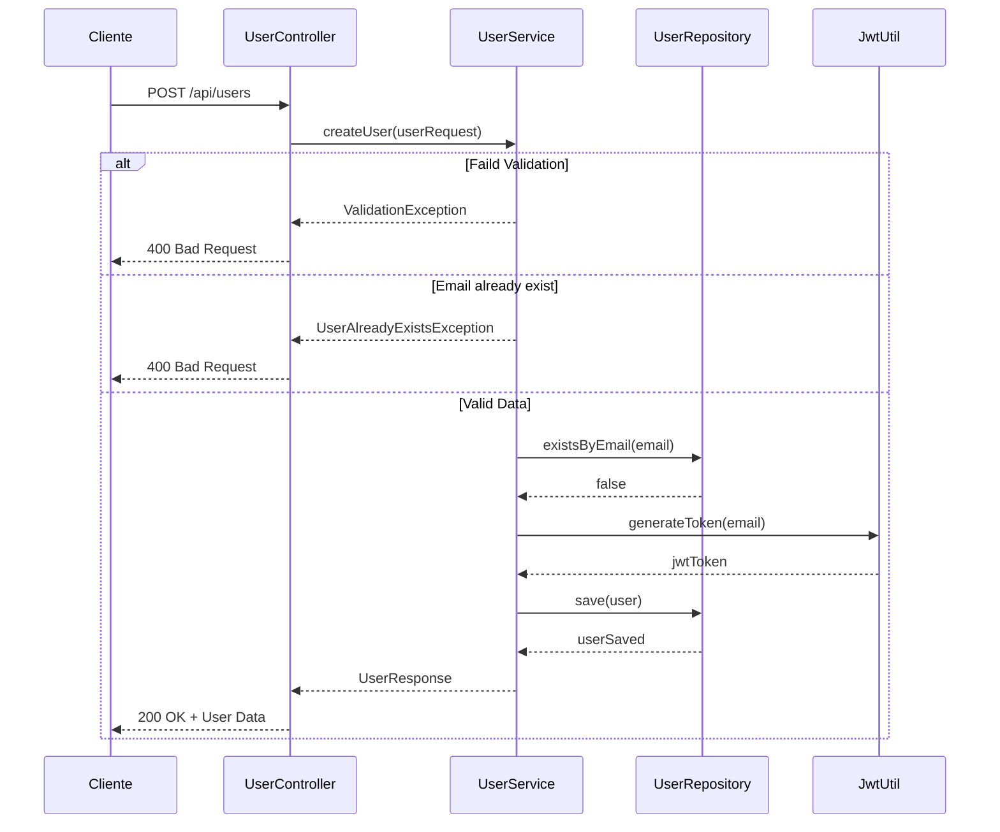

```mermaid
sequenceDiagram
    participant C as Cliente
    participant UC as UserController
    participant US as UserService
    participant UR as UserRepository
    participant JWT as JwtUtil

    C->>UC: POST /api/users
    UC->>US: createUser(userRequest)
    
    alt Faild Validation
        US-->>UC: ValidationException
        UC-->>C: 400 Bad Request
    else Email already exist
        US-->>UC: UserAlreadyExistsException
        UC-->>C: 400 Bad Request
    else Valid Data
        US->>UR: existsByEmail(email)
        UR-->>US: false
        US->>JWT: generateToken(email)
        JWT-->>US: jwtToken
        US->>UR: save(user)
        UR-->>US: userSaved
        US-->>UC: UserResponse
        UC-->>C: 200 OK + User Data
    end
```
