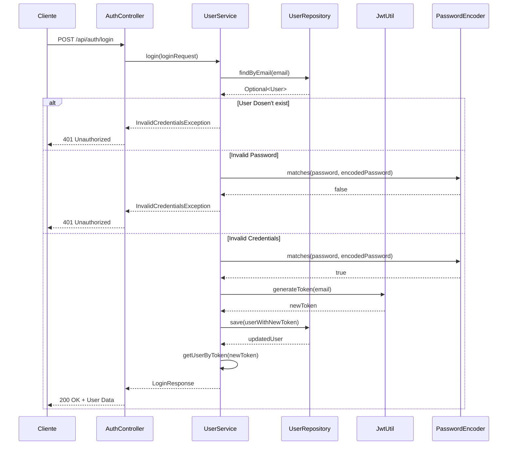

```mermaid
sequenceDiagram
participant C as Cliente
participant AC as AuthController
participant US as UserService
participant UR as UserRepository
participant JWT as JwtUtil
participant PE as PasswordEncoder

    C->>AC: POST /api/auth/login
    AC->>US: login(loginRequest)
    
    US->>UR: findByEmail(email)
    UR-->>US: Optional<User>
    
    alt User Dosen't exist
        US-->>AC: InvalidCredentialsException
        AC-->>C: 401 Unauthorized
    else Invalid Password
        US->>PE: matches(password, encodedPassword)
        PE-->>US: false
        US-->>AC: InvalidCredentialsException
        AC-->>C: 401 Unauthorized
    else Invalid Credentials
        US->>PE: matches(password, encodedPassword)
        PE-->>US: true
        US->>JWT: generateToken(email)
        JWT-->>US: newToken
        US->>UR: save(userWithNewToken)
        UR-->>US: updatedUser
        US->>US: getUserByToken(newToken)
        US-->>AC: LoginResponse
        AC-->>C: 200 OK + User Data
    end
```
