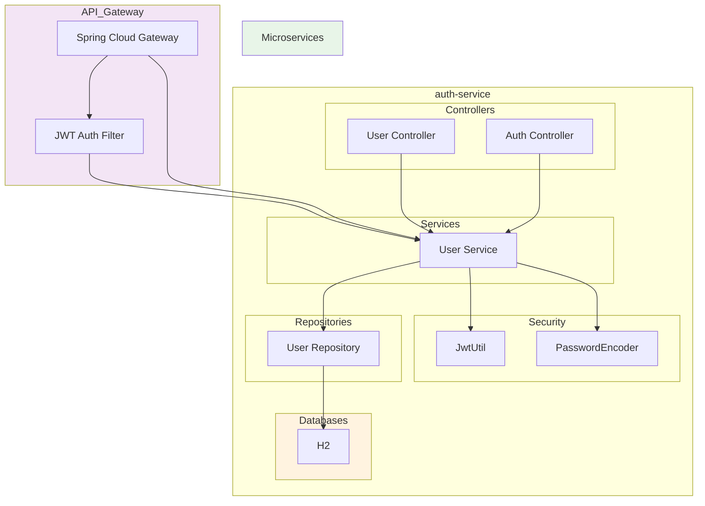

```mermaid
graph TB
   
    subgraph API_Gateway
        GW[Spring Cloud Gateway]
        AF[JWT Auth Filter]
    end
    
    subgraph auth-service
      subgraph Controllers
        UC[User Controller]
        AC[Auth Controller]
      end
      subgraph Services
        US[User Service]
      end
      subgraph Security
        JU[JwtUtil]
        PE[PasswordEncoder]
      end
      subgraph Repositories
        UR[User Repository]
      end
      subgraph Databases
        PG[H2]
      end
    end
    
    

    GW --> AF
    AF --> US
    GW --> US
    UC --> US
    AC --> US
    US --> UR
    US --> JU
    US --> PE
    UR --> PG

    style API_Gateway fill:#f3e5f5
    style Microservices fill:#e8f5e8
    style Databases fill:#fff3e0
```
